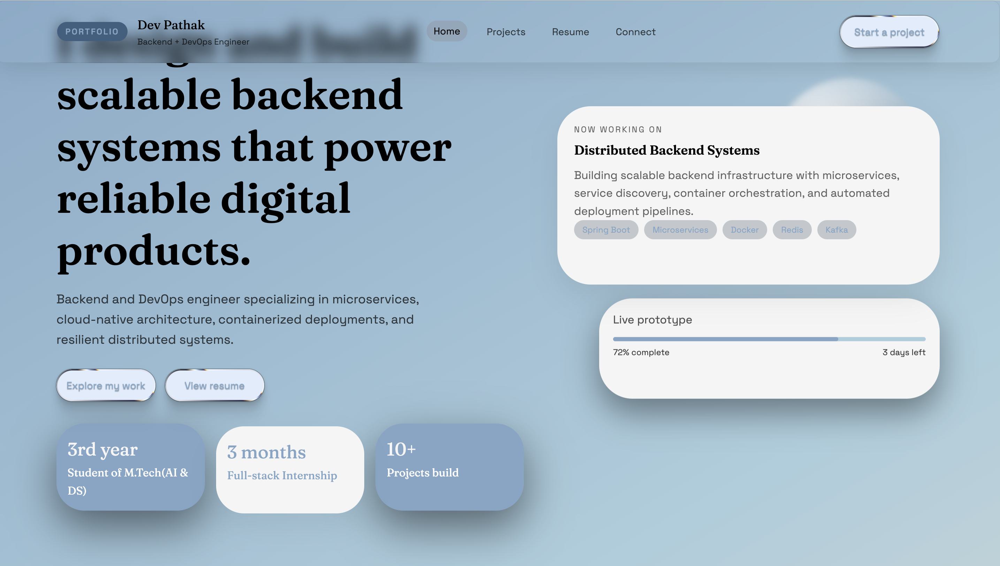
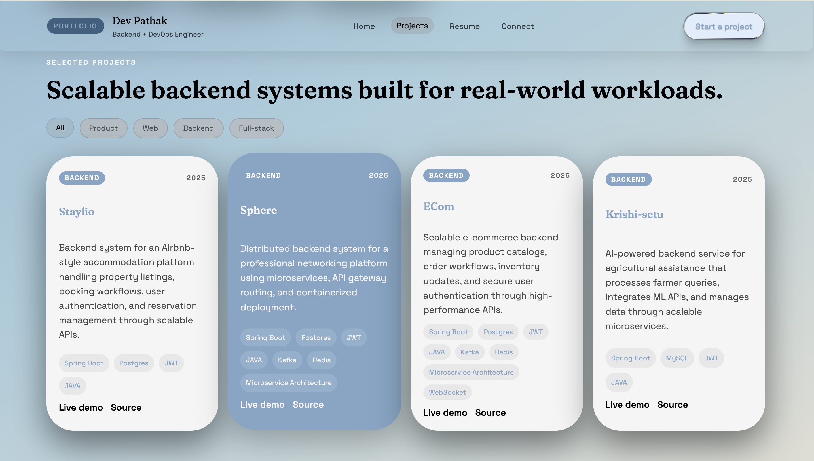
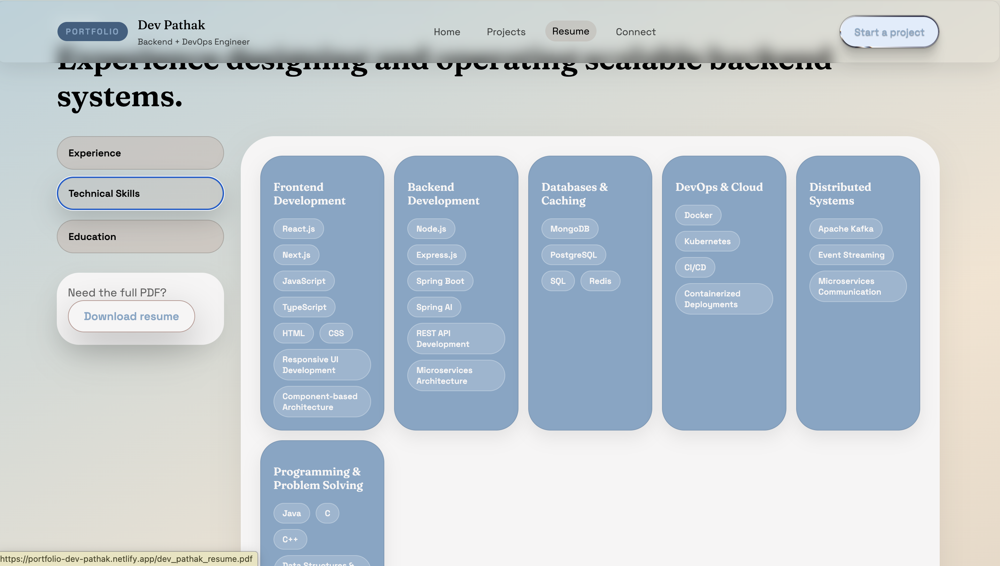
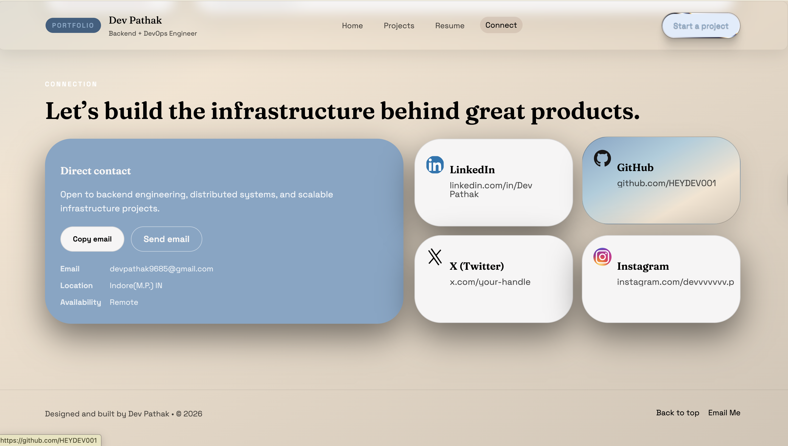

# Portfolio

> **Personal portfolio website of Dev Pathak** — Backend + DevOps Engineer

[](https://portfolio-dev-pathak.vercel.app)
[](https://reactjs.org/)
[](https://www.typescriptlang.org/)
[](https://tailwindcss.com/)
[](https://vitejs.dev/)

---

##  Preview

| Home | Projects |
|------|----------|
|  |  |

> **Note:** Screenshots below show the live portfolio in action.

###  Hero & Home

*Landing page with hero tagline, current project widget, and key stats.*

###  Projects

*Filterable project showcase with tech stack tags, live demos, and source links.*

###  Resume — Technical Skills

*Interactive resume page with skill categories and PDF download.*

###  Connect

*Contact section with direct email, social links, and availability status.*

---

##  Project Objective

This portfolio was built to **professionally represent Dev Pathak** as a Backend + DevOps Engineer specialising in microservices, cloud-native architecture, containerised deployments, and resilient distributed systems.

The core goals of this project are:

- Present a clean, developer-focused personal brand with a polished UI
- Showcase real-world backend and full-stack projects (Staylio, Sphere, ECom, Krishi-setu)
- Provide a structured, downloadable resume with interactive skill categories
- Offer a frictionless contact experience for recruiters and collaborators
- Demonstrate frontend engineering capability using modern tooling (React, TypeScript, Tailwind, Vite)

---

##  Project Structure

```
Portfolio/
├── public/                     # Static assets served directly
│   └── (favicon, icons, etc.)
│
├── src/                        # Application source code
│   ├── components/             # Reusable UI components
│   │   ├── Navbar.tsx          # Sticky navigation with active-link highlighting
│   │   ├── Hero.tsx            # Landing section with headline & stats widgets
│   │   ├── Projects.tsx        # Project cards with category filter
│   │   ├── Resume.tsx          # Tabbed resume (Experience / Skills / Education)
│   │   ├── Connect.tsx         # Contact section with social links
│   │   └── Footer.tsx          # Footer with back-to-top & email shortcut
│   │
│   ├── data/                   # Static data / content config
│   │   └── projects.ts         # Project entries (title, description, tags, links)
│   │
│   ├── types/                  # TypeScript interfaces & type definitions
│   ├── App.tsx                 # Root component — page layout & routing
│   ├── main.tsx                # React DOM entry point
│   └── index.css               # Global styles & Tailwind directives
│
├── index.html                  # Vite HTML entry point
├── vite.config.ts              # Vite configuration
├── tailwind.config.js          # Tailwind CSS theme & content config
├── postcss.config.js           # PostCSS pipeline config
├── tsconfig.json               # Root TypeScript config
├── tsconfig.app.json           # App-specific TS config
├── tsconfig.node.json          # Node/Vite TS config
├── eslint.config.js            # ESLint flat config with type-aware rules
├── package.json                # Dependencies and scripts
└── .gitignore
```

---

##  Key Features

###  Hero Section
- Bold, developer-centric tagline with animated entrance
- **"Now Working On"** live widget showing current project (Distributed Backend Systems) with tech stack tags
- **Live prototype progress bar** widget (72% complete, 3 days left)
- Key stats: 3rd year M.Tech (AI & DS) student, 3-month full-stack internship, 10+ projects built

###  Projects Showcase
- **Filterable by category**: All / Product / Web / Backend / Full-stack
- Four featured backend projects with descriptions, year, and tech stack tags:
  | Project | Description |
  |---|---|
  | **Staylio** | Airbnb-style accommodation backend — property listings, bookings, auth, reservations |
  | **Sphere** | Distributed professional networking backend — microservices, API gateway, containerised |
  | **ECom** | Scalable e-commerce backend — product catalogs, order workflows, WebSocket, high-perf APIs |
  | **Krishi-setu** | AI-powered agricultural assistance — ML API integration, microservices, farmer queries |
- Each card links to **Live Demo** and **Source** repository

###  Interactive Resume
- Three tabs: **Experience**, **Technical Skills**, **Education**
- Visual skill category cards:
  - Frontend: React.js, Next.js, TypeScript, JavaScript, HTML/CSS, Responsive UI
  - Backend: Node.js, Express.js, Spring Boot, Spring AI, REST API, Microservices
  - Databases & Caching: MongoDB, PostgreSQL, SQL, Redis
  - DevOps & Cloud: Docker, Kubernetes, CI/CD, Containerised Deployments
  - Distributed Systems: Apache Kafka, Event Streaming, Microservices Communication
  - Programming: Java, C, C++, Data Structures
- **One-click PDF resume download** via direct link

###  Connect Section
- Direct contact card with **Copy Email** and **Send Email** buttons
- Social profile links: LinkedIn, GitHub, X (Twitter), Instagram
- Availability status: **Remote**, Location: Indore (M.P.), IN

###  Design & UX
- Soft blue-grey gradient theme with consistent card-based layout
- Fully **responsive** across desktop and mobile viewports
- Smooth scroll navigation with **active tab highlighting**
- **"Start a project"** CTA button persistent in the navbar

---

##  Tech Stack

| Layer | Technology |
|---|---|
| UI Framework | React 18 |
| Language | TypeScript (65.5%) |
| Styling | Tailwind CSS (32.5%) |
| Build Tool | Vite |
| Linting | ESLint (flat config, type-aware) |
| Deployment | Vercel |

---

##  Challenges & Optimisations

### 1. Filter State Management Without a State Library
**Challenge:** Implementing category-based project filtering (All / Product / Web / Backend / Full-stack) without introducing Redux or Zustand while keeping the component clean and performant.

**Optimisation:** Used React's built-in `useState` hook with a derived filtered list computed via `useMemo`, avoiding unnecessary re-renders. The active filter badge provides instant visual feedback with zero external dependencies.

---

### 2. Responsive Layout with Tailwind CSS
**Challenge:** Achieving a consistent card-grid layout across widely varying viewport sizes — particularly the multi-column project cards and the skills grid — without writing custom media queries.

**Optimisation:** Leveraged Tailwind's responsive utility prefixes (`sm:`, `md:`, `lg:`) with a mobile-first approach. Used CSS Grid and Flexbox utility classes to handle reflow gracefully, ensuring the layout collapses naturally on smaller screens without breakage.

---

### 3. Performance-Conscious Asset Delivery
**Challenge:** Ensuring fast initial load times on Vercel without lazy-loading complexity while keeping the bundle size minimal.

**Optimisation:** Vite's built-in code splitting and tree-shaking handles dead-code elimination automatically. Static assets are served from the `public/` directory with cache-friendly headers via Vercel's edge network, keeping Time-to-Interactive low.

---

##  Getting Started

```bash
# Clone the repository
git clone https://github.com/HEYDEV001/Portfolio.git
cd Portfolio

# Install dependencies
npm install

# Start development server
npm run dev

# Build for production
npm run build

# Preview production build locally
npm run preview
```

> The dev server runs at `http://localhost:5173` by default.

---

##  Deployment

The portfolio is deployed on **Vercel** with automatic deployments on every push to `main`.

Live URL: [https://portfolio-dev-pathak.vercel.app](https://portfolio-dev-pathak.vercel.app)

---

##  Contact

| Channel | Details |
|---|---|
| Email | devpathak9685@gmail.com |
| LinkedIn | [linkedin.com/in/Dev Pathak](https://linkedin.com/in/DevPathak) |
| GitHub | [github.com/HEYDEV001](https://github.com/HEYDEV001) |
| Location | Indore, M.P., India |
| Availability | Remote |

---

## Author

**HEYDEV001**
[github.com/HEYDEV001](https://github.com/HEYDEV001)

---
